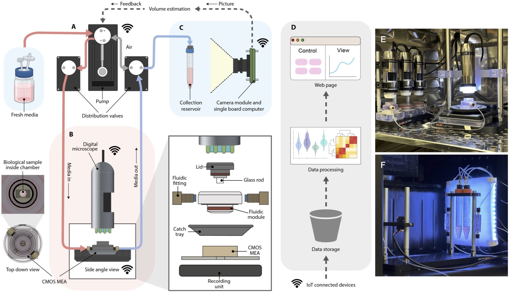

# feedback-organoid-platform
Supplementary Materials to Elsevier IoT journal article:

***"A feedback-driven brain organoid platform enables automated maintenance and high-resolution neural activity monitoring"***

[https://doi.org/10.1016/j.iot.2025.101671](https://doi.org/10.1016/j.iot.2025.101671)

## Overview

This work presents a laboratory robotics system that uses IoT collaboration to improve the control of cell culture experiments.
The main parts include software for IoT devices, computer vision analysis, an example  bill of materials, and 3D printed components for setting up the system.
This repository includes documentation on how to use and assemble the system.

## Hardware
- Bill of Materials (BOM) for putting together the system is inside [`./hardware`](https://github.com/braingeneers/integrated-system-v1-paper/tree/main/hardware).
- CAD files for 3D printed files and reference assemblies are inside [`./hardware/3D_printed_parts`](https://github.com/braingeneers/integrated-system-v1-paper/tree/main/hardware/3D_printed_parts).

## Software
Software for IoT devices is in [`./software`](https://github.com/braingeneers/integrated-system-v1-paper/tree/main/software).
- *device-class*: [`braingeneerpy`](https://github.com/braingeneers/braingeneerspy)
   - Usage: `from braingeneers.iot import Device`
- *device-class* child implementations: [`./software`](https://github.com/braingeneers/integrated-system-v1-paper/tree/main/software)
   - Electrophysiology recording: MaxWell MaxOne [`./software/maxwell`](https://github.com/braingeneers/integrated-system-v1-paper/tree/main/software/maxwell)
   - Microscope imaging: DinoLite [`./software/dinolite-microscope-camera`](https://github.com/braingeneers/integrated-system-v1-paper/tree/main/software/dinolite-microscope-camera)
   - Fluidic feeding: Autoculture [`./software/fluidics`](https://github.com/braingeneers/integrated-system-v1-paper/tree/main/software/fluidics)
   - Fluid level imaging: Camera [`./software/fluid-level-camera`](https://github.com/braingeneers/integrated-system-v1-paper/tree/main/software/fluid-level-camera)
- Fluid level estimator: [`./software/estimator`](https://github.com/braingeneers/integrated-system-v1-paper/tree/main/software/estimator)

© 2025 Braingeneers
