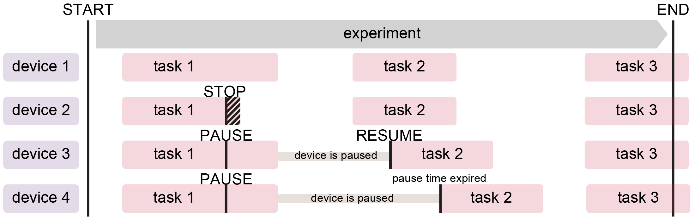
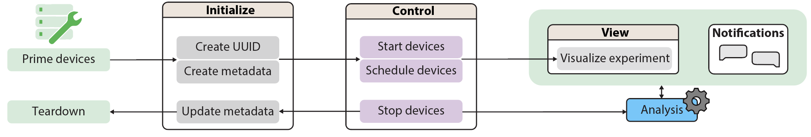

# Device-class

## Parent `Device`-class
The `Device` class inside [braingeneerspy](https://github.com/braingeneers/braingeneerspy/tree/master) `src/braingeneers/iot/device.py` provides standard features across all IoT devices: 
  - a state machine defining standard behavior (i.e., experiment workflow)
  - structured framework for processing incoming request messages
  - autonomous task scheduling, timing, and execution
  - multi-tasking and responsiveness to user requests via threading
  - database operations (i.e., updating current state (shadow) and tracking experiment settings)
  - communication via MQTT messaging (including alerts via Slack bridge)
  - data upload/download in the background with queueing and retry mechanisms
  - error handling mechanisms  
  - interfacing and working with other devices (of `Device` parent class) in a fleet

A child of the parent class `Device` will inherit all basic functionality, and may add additional features. For instance, a camera `Device` child performs all actions that a `Device` can, plus it knows how to handle a request to take a picture.

## `ExampleDevice` Demo Code

Inside the [braingeneerspy](https://github.com/braingeneers/braingeneerspy/tree/master) in `src/braingeneers/iot/`, see:
- [`example_device.py`](https://github.com/braingeneers/braingeneerspy/blob/master/src/braingeneers/iot/example_device.py): implementation for example device (child)
- [`example_device_main.py`](https://github.com/braingeneers/braingeneerspy/blob/master/src/braingeneers/iot/example_device_main.py): launch script for example device (child)


Abbreviated example:
```python
from braingeneers.iot.device import Device 

class ExampleDevice(Device): 
    """ Example Device Class
    Demonstrates how to use and inherit the Device class for new application
    """
    def __init__(self, device_name, eggs = 0, ham = 0):
        """Initialize the ExampleDevice class
        Args: 
            device_name (str): name of the device
            ham (str): starting quantity of ham
            eggs (int): starting quantity of eggs

        :param device_specific_handlers: dictionary that maps the device's command keywords 
        to a function call that handles an incoming command.
        """
        self.eggs = eggs
        self.ham = ham

        super().__init__(device_name=device_name, device_type = "Other", primed_default=True)

        self.device_specific_handlers.update({ 
            "ADD": self.handle_add, # new command to add any amount of eggs or ham
            "LIST": self.handle_list # new command to list current amount of eggs and ham by message
        }) 
        return

    @property
    def device_state(self):
        """
        Return the device state as a dictionary. This is used by the parent Device class to update the device shadow.
        Child can add any additional device specific state to the dictionary i.e., "EGGS" and "HAM"
        """
        return { **super().device_state,
                "EGGS": self.eggs, 
                "HAM": self.ham
                }

    def is_primed(self):
        """
        Modify this function if your device requires a physical prerequsite. 
        In Parent initialization, when primed_default=True no physical prerequsite is required.

        If a physical prerequsite is required, set primed_default=False and modify this function to check for a condition to be met to return True. 

        For example, you may wait for a hardware button press confirming that a physical resource is attached (i.e., a consumable, like fresh media) before allowing 
        the device to be used in an experiment.

        This function should not perform any blocking/loops because it is checked periodically by the parent loop in "IDLE" state!
        """
        return self.primed_default


    def handle_add(self, topic, message):
        """
        Function to handle the ADD command. This function is called by the parent Device class when an ADD command is received.
        Args:
            topic (str): topic of the received message
            message (dict): message received by the device
        ADD assumes that the message contains the keys "EGGS" and "HAM" and adds the values to the device's state.
        """
        try:
            self.eggs += message["EGGS"]
            self.ham += message["HAM"]
            self.update_state(self.state) # to update eggs and ham change ASAP in shadow
        except:
            self.mb.publish_message(topic= self.generate_response_topic("ADD", "ERROR"),
                                    message= { "COMMAND": "ADD-ERROR",
                                                "ERROR": f"Missing argument for EGGS or HAM"})
        return

    def handle_list(self, topic, message):
        """
        Function to handle the LIST command. This function is called by the parent Device class when an LIST command is received.
        Args:
            topic (str): topic of the received message
            message (dict): message received by the device
        LIST responds with a message containing the current values for "EGGS" and "HAM".
        """
        self.mb.publish_message(topic=self.generate_response_topic("LIST", "RESPONSE"),
                                message= { "COMMAND": "LIST-RESPONSE",
                                            "EGGS": self.eggs,
                                            "HAM" : self.ham })
        return  


import argparse

if __name__ == "__main__":

    parser = argparse.ArgumentParser(description="Command line tool for the ExampleDevice utility")
    # Adding arguments with default values and making them optional
    parser.add_argument('--device_name', type=str, required=False, default="spam", help='Name of device (default: spam)')
    parser.add_argument('--eggs', type=int, required=False, default=0, help='Starting quantity of eggs (default: 0)')
    parser.add_argument('--ham', type=int, required=False, default=0, help='Starting quantity of ham (default: 0)')
    args = parser.parse_args()

    # Create a device object
    device = ExampleDevice(device_name=args.device_name, eggs=args.eggs, ham=args.ham)

    # Start the device activities, running in a loop
    # Control + C should gracefully stop execution
    device.start_mqtt()

```


Start a new repo with copies of `example_device.py` and `example_device_main.py`. You can run them directly as a "hello-world" example.
Modify these files for your specific device application.  

`example_device.py` imports `Device` from `braingeneers` python package as: 

```python
from braingeneers.iot import Device
```


### Inheritance

We call the `Device` class parent, and any other class of device inheriting the parent (i.e., a microscope) to be the child.

The child class must implement the following to get proper functionality from the parent:

- Inside the child's `__init__()` fuction, initialize the parent with `super().__init__(device_name, device_type, primed_default)`.
- Inside the child's `__init__()` fuction, define and populate `self.device_specific_handlers()` dictionary. Each key should be the child's job command (i.e., `"LIST"`) and value the handler function (i.e., `handle_list`). Using `.update` carries over exiting mappings defined in the parent (such as `"TWIDDLE"`, which is the default/debugging function that keeps a device busy in the EXEC state for a certain duration).
```python
        self.device_specific_handlers.update({
            "ADD": self.handle_add,
            "LIST": self.handle_list,
            ...
        })
```
- The property device_state will return a set of variables user chooses to expose to the shadow database. Calling `**super().device_state` will include all variables from the parent. Additional variables for the child device must be added below.
```python
       return { **super().device_state,
                "EGGS": self.eggs, 
                "HAM": self.ham
                }
```   
- The function `is_primed()` will `return self.primed_default` unless child overrides it by re-defining the function to check for specific variables/conditions it requires to become primed.
- In order for `STOP` command to be effective at quickly terminating execution, child must implement checking for `self.stop_event.is_set()` inside of its device specific functions, especially if these functions are lengthy/don't immediately exit (i.e., recording for 10min).
```python
          while not self.stop_event.is_set() and datetime.now() < twiddle_until:
                time.sleep(1)
```
- Check that the child does not use the same variable names as the parent class (unintentionally). Otherwise, this will override them and create unpredictable behavior.


## `Device` Class: State Machine

Device state machine diagram:

**Summary**


Device states:

1. **IDLE**: The device is not assigned to any experiments and not doing anything at the moment, and is missing physical prerequisites (i.e., a reagent or piece of hardware) to be able to perform its job.

2. **PRIMED**: The device is not assigned to any experiments and not doing anything at the moment, but it has all the physical prerequisites to perform its job.

3. **READY**: The device is assigned to an experiment and is ready to execute a command.

4. **WAITING**: The device has received a command to PAUSE and is waiting until a given time to resume performing jobs.

5. **EXEC**: The device is actively executing a job command.

6. **SHUTDOWN**: The device has been turned off gracefully and won't respond until it's turned back on.

Note that if a device is abruptly disconnected from power or crashes, it will be unresponsive to requests, and its state will be frozen in the database at the last updated state.

## `Device` Class: MQTT Messages

The MQTT messages arrive on a topic and are formatted as JSON dictionaries with key-value pairs.

### Topics

General MQTT topic rules for subscription:

- Multi-level wildcards: `mqtt/multilevel/hierarchy/wildcards/go/at/the/end/only/#`
- Single-level wildcards: `mqtt/singlelevel/+/hierarchy/wildcards/+/go/anywhere`

The device subscribes and publishes messages on specific topics. The topics are constructed as follows:

**Topic Format**
- device specific topic: `<root_topic>/<experiment_uuid>/<logging-token>/<device_name>/<COMMAND_KEY>/<COMMAND_VALUE>`
- general experiment topic: `<root_topic>/<experiment_uuid>/<logging-token>/<COMMAND_KEY>/<COMMAND_VALUE>`

**Examples**
  - Addresses all devices part of the experiment: `telemetry/0000-00-00-efi-testing/log/PAUSE/REQUEST`
  - Addresses the device `dorothy` only: `telemetry/0000-00-00-efi-testing/log/dorothy/PAUSE/REQUEST`

#### Commands every device knows (`<COMMAND_KEY>`)

- To start and stop a device on an experiment UUID: `START`, `END`
- To pause and resume and device's execution of the experiment: `PAUSE`, `RESUME`
- To assign task(s) to a device now or later or terminate a task: `STOP`, `SCHEDULE`, and `<ANY_DEVICE_SPECIFIC_COMMAND>` like `TWIDDLE` 
- To check if the device is responsive or check current tasks via message (instead of shadow database): `PING`, `STATUS`

- Illustration of commands influencing experiment flow and command combination scenarios:


#### Command values every device knows (`<COMMAND_VALUE>`)

Each `<COMMAND_KEY>` pairs with a `<COMMAND_VALUE>`, which is a sub-classification of the command:

- To ask for the device to execute a command: `REQUEST`
- Device acknowledges receiving a request command: `ACK`
- Device may produce an output message as a result of the command: `RESPONSE`
- Device reports on task completion: `COMPLETE`
- Device encountered an error in task execution: `ERROR`


### MQTT Message Commands

<details>
<summary><b>1. Start Experiment</b></summary>

- **Topic Structure:** `telemetry/NONE/log/<device_name>/START/<COMMAND_VALUE>`
- **Command Values:** `REQUEST`, `RESPONSE`, `ACK`, `COMPLETE`, `ERROR`
- **Example:** `telemetry/NONE/log/dorothy/START/REQUEST`
- **Payload:**
  - Start Request:
    ```json
    {
        "COMMAND": "START-REQUEST",
        "UUID": "<experiment_uuid>",
        "TEAMMATES": ["teammate1", "teammate2", ...]
    }
    ```
  - Start Responses:
    - Success: `{"COMMAND": "START-COMPLETE", "FROM": "<device_name>"}`
    - Errors:
      - Not Primed: `{"COMMAND": "START-ERROR", "ERROR": "Not PRIMED", "FROM": "<device_name>"}`
      - Already in Experiment: `{"COMMAND": "START-ERROR", "ERROR": "Already in experiment <experiment_uuid>", "FROM": "<device_name>"}`
      - Invalid UUID: `{"COMMAND": "START-ERROR", "ERROR": "Invalid UUID <experiment_uuid>, please use format YYYY-MM-DD-efi-experiment-name", "FROM": "<device_name>"}`
- **Description:** Initiates an experiment process on a specified device. The device must not be engaged in another experiment and should be in a PRIMED state. If successful, the device acknowledges the request and changes its state to "READY".

</details>


<details>
<summary><b>2. End Experiment</b></summary>

- **Topic Structure:** `telemetry/<experiment_uuid>/log/<device_name>/END/<COMMAND_VALUE>`
- **Alternative Topic Structure:** `telemetry/<experiment_uuid>/log/END/<COMMAND_VALUE>`
- **Command Values:** `REQUEST`, `ACK`, `COMPLETE`, `ERROR`
- **Example:** `telemetry/0000-00-00-efi-testing/log/dorothy/END/REQUEST` to stop a specific device 
`telemetry/0000-00-00-efi-testing/log/END/REQUEST` to stop all devices on the experiment
- **Payload:** 
  - End Request: `{"COMMAND": "END-REQUEST"}`
  - End Responses:
    - Success: `{"COMMAND": "END-COMPLETE", "FROM": "<device_name>"}`
- **Description:** Ends an ongoing experiment on a device or all devices associated with an experiment UUID. The device(s) will drop current tasks and reset to "IDLE" state.

</details>

<details>
<summary><b>3. Get Device Status</b></summary>

- **Topic Structure:** `telemetry/<experiment_uuid>/log/<device_name>/STATUS/<COMMAND_VALUE>`
- **Alternative Topic Structure:** `telemetry/<experiment_uuid>/log/STATUS/<COMMAND_VALUE>`
- **Command Values:** `REQUEST`, `ACK`, `COMPLETE`, `ERROR`
- **Example:** `telemetry/0000-00-00-efi-testing/log/dorothy/STATUS/REQUEST` or 
`telemetry/0000-00-00-efi-testing/log/<device_name>/STATUS/REQUEST` to query all devices on the experiment.
- **Payload:** 
  - Status Request: `{"COMMAND": "STATUS-REQUEST"}`
  - Status Responses:
    - Success:
      ```json
      {
        "COMMAND": "STATUS-RESPONSE",
        "FROM": "<device_name>",
        "STATE": "<state>",
        "UUID": "<experiment_uuid>",
        "TEAMMATES": ["<teammate1>", "<teammate2>"],
        "SCHEDULE": "<schedule_details>"
      }
      ```
- **Description:** Retrieves the current status, state, associated experiment UUID, teammates, and schedule of the device. Works in any device state.

</details>

<details>
<summary><b>4. Pause Device Execution</b></summary>

- **Topic Structure:** `telemetry/NONE/log/<device_name>/PAUSE/<COMMAND_VALUE>`
- **Alternative Topic Structure:** `telemetry/<experiment_uuid>/log/PAUSE/<COMMAND_VALUE>`
- **Command Values:** `REQUEST`, `ACK`, `COMPLETE`, `ERROR`
- **Example:** `telemetry/0000-00-00-efi-testing/log/dorothy/PAUSE/REQUEST` to stop a specific device 
`telemetry/0000-00-00-efi-testing/log/PAUSE/REQUEST` to stop all devices on the experiment
- **Payload:** 
  - Pause Request: `{"COMMAND": "PAUSE-REQUEST", "SECONDS": <pause_duration_seconds>, "FROM": <sender_device_name>}`
  - Pause Responses:
    - Success: `{"COMMAND": "PAUSE-ACK", "TIMESTAMP": "<YYY-MM-DD HH:MM:SS>", "FROM": "<device_name>"}`
    - Errors:
      - Already Paused: `{"COMMAND": "PAUSE-ERROR", "ERROR": "Already paused until <time> by <sender>", "FROM": "<device_name>"}`
      - No Experiment: `{"COMMAND": "PAUSE-ERROR", "ERROR": "No experiment to pause", "FROM": "<device_name>"}`
- **Description:** Temporarily halts the device ability to start working on new commands for a specified duration. If the device is already paused or not part of an experiment, it will return an error. Otherwise, device will successfully change its state to "WAITING".


</details>

<details>
<summary><b>5. Resume Device Execution</b></summary>

- **Topic Structure:** `telemetry/NONE/log/<device_name>/RESUME/<COMMAND_VALUE>`
- **Alternative Topic Structure:** `telemetry/<experiment_uuid>/log/RESUME/<COMMAND_VALUE>`
- **Command Values:** `REQUEST`, `ACK`, `COMPLETE`, `ERROR`
- **Example:** `telemetry/0000-00-00-efi-testing/log/dorothy/RESUME/REQUEST` to stop a specific device 
`telemetry/0000-00-00-efi-testing/log/RESUME/REQUEST` to stop all devices on the experiment
- **Payload:** 
  - Resume Request: `{"COMMAND": "RESUME-REQUEST", "FROM": <sender_device_name>}`
  - Resume Responses:
    - Success: `{"COMMAND": "RESUME-ACK", "FROM": "<device_name>"}`
    - Errors:
      - Wrong Sender: `{"COMMAND": "RESUME-ERROR", "ERROR": "Can't resume because you're not <who_paused>", "FROM": "<device_name>"}`
      - Not Waiting: `{"COMMAND": "RESUME-ERROR", "ERROR": "Not WAITING, nothing to resume", "FROM": "<device_name>"}`
- **Description:** Requests the device to continue execution after a pause. Only the device that initiated the pause can send a resume command. Paused device will successfully change its state to "WAITING".

</details>


<details>
<summary><b>6. Schedule Task</b></summary>

- **Topic Structure:** `telemetry/NONE/log/<device_name>/SCHEDULE/<COMMAND_VALUE>`
- **Command Values:** `REQUEST`, `ACK`, `COMPLETE`, `ERROR`
- **Example:** `telemetry/0000-00-00-efi-testing/log/dorothy/SCHEDULE/REQUEST`
- **Payload:**
  - Schedule Request: 
    - Add: 
      ```json
      {
      "COMMAND": "SCHEDULE-REQUEST",
      "TYPE": "ADD",
      "EVERY_X_HOURS": <hours_interval>,
      "AT": "<time_of_hour (MM)?:SS), i.e., 15:10, or :15>",
      "DO": {
          "<task_name>": "<task_payload>"
          }
      }
      ```
      or
      ```json
      {
      "COMMAND": "SCHEDULE-REQUEST",
      "TYPE": "ADD",
      "EVERY_X_MINUTES": <minutes_interval>,
      "DO": {
          "<task_name>": "<task_payload>"
          }
      } 
      ```
      or
      ```json
      {
      "COMMAND": "SCHEDULE-REQUEST",
      "TYPE": "ADD",
      "EVERY_X_DAYS": <days_interval (i.e., 1)>,
      "AT": "time of day HH:MM(:SS) i.e., 15:36 or 15:36:42",
      "DO": {
          "<task_name>": "<task_payload>"
          }
      }
      ```
    - Clear all: `{"COMMAND": "SCHEDULE-REQUEST", "TYPE": "CLEAR",}`
    - Clear specific: `{"COMMAND": "SCHEDULE-REQUEST", "TYPE": "CLEAR", "TAG": <schedule_job_tag displayed in shadow or STATUS return>}`
    - Get: `{"COMMAND": "SCHEDULE-REQUEST", "TYPE": "GET"}`
  - Schedule Responses:
    - Success: 
      - Add or Clear: `{"COMMAND": "SCHEDULE-COMPLETE", "FROM": "<device_name>"}`
      - Get: `{"COMMAND": "SCHEDULE-RESPONSE", "FROM": "<device_name>", "SCHEDULE": "<schedule_details>"}`
    - Errors:
      - Missing time:
        ```json
        {
          "COMMAND": "SCHEDULE-ERROR",
          "ERROR": "Must specify either EVERY_X_HOURS or EVERY_X_MINUTES",
          "FROM": "<device_name>"
        }
        ```
      - Undefined Command:
        ```json
        {
          "COMMAND": "SCHEDULE-ERROR",
          "ERROR": "Undefined schedule command, <command>",
          "FROM": "<device_name>"
        }
        ```
      - Wrong State:
        ```json
        {
          "SCHEDULE": "SCHEDULE-ERROR",
          "ERROR": "Device is <state>. No experiment to schedule",
          "FROM": "<device_name>"
        }
        ```
- **Description:** Adds, clears, or retrieves scheduled tasks for the device. The device will execute the specified task payload at the specified time every X hours or minutes (unless it's WAITING, then it will do backlogged tasks at easiest convenience). Works in any state.


</details>


<details>
<summary><b>7. Stop Current Task</b></summary>

- **Topic Structure:** `telemetry/NONE/log/<device_name>/STOP/<COMMAND_VALUE>`
- **Alternative Topic Structure:** `telemetry/<experiment_uuid>/log/STOP/<COMMAND_VALUE>`
- **Command Values:** `REQUEST`, `ACK`, `COMPLETE`, `ERROR`
- **Example:** `telemetry/0000-00-00-efi-testing/log/dorothy/STOP/REQUEST` to stop tast exection on a specific device 
`telemetry/0000-00-00-efi-testing/log/STOP/REQUEST` to stop task execution on all devices on the experiment
- **Payload:** 
  - Stop Request: `{"COMMAND": "STOP-REQUEST", "FROM": "<sender_device_name>"}`
  - Stop Responses:
    - Success: `{"COMMAND": "STOP-COMPLETE", "TIMESTAMP: <YYY-MM-DD HH:MM:SS>, "FROM": "<device_name>"}`
    - Errors:
      - Wrong State: `{"COMMAND": "STOP-ERROR", "ERROR": "In state <state> and not executing anything to stop", "FROM": "<device_name>"}`
- **Description:** Requests the cancellation of a running task. If there is no task running, an error message is returned.

</details>


<details>
<summary><b>8. Ping</b></summary>

- **Topic Structure:** `telemetry/NONE/log/<device_name>/PING/<COMMAND_VALUE>`
- **Alternative Topic Structure:** `telemetry/<experiment_uuid>/log/PING/<COMMAND_VALUE>`
- **Command Values:** `REQUEST`, `RESPONSE`
- **Example:** `telemetry/0000-00-00-efi-testing/log/dorothy/PING/REQUEST` to stop tast exection on a specific device 
`telemetry/0000-00-00-efi-testing/log/PING/REQUEST` to stop task execution on all devices on the experiment
- **Payload:** 
  - Ping Request: `{"COMMAND": "PING-REQUEST", "FROM": "<sender_device_name>"}`
  - Ping Responses:
    - Success: `{"COMMAND": "PING-COMPLETE", "TIMESTAMP: <YYY-MM-DD HH:MM:SS>, "FROM": "<device_name>"}`
    - Errors:
      - Wrong State: `{"COMMAND": "PING-ERROR", "ERROR": "In state <state> and not executing anything to stop", "FROM": "<device_name>"}`
- **Description:** Requests the device to respond with a ping message. This is used to check if the device is online and listening on a given topic. Works in any state.

</details>


<details>
<summary><b>9. Slack</b></summary>


<b>Post to Slack</b>

- **Topic Structure:** `telemetry/slack/TOSLACK/iot-experiments`
- **Payload:** 
  ```json
  {
    "message": "<text_message>",
    "filename": "<image_filename>",
    "image": "<base64_encoded_image_data>"
  }
  ```
- **Description:** Posts a message to Slack. It can include a text message and an optional image.

<b>Getting Users from Slack</b>

  ```
  # specific channels
  telemetry/slack/TOSLACK/iot-experiments/log/UUID/USERS/REQUEST {"channels": ["iot-requests", "data-lifecycle"]}

  # all channels
  telemetry/slack/TOSLACK/iot-experiments/log/UUID/USERS/REQUEST {"channels": none}

  # user/id list requested
  telemetry/slack/FROMSLACK/iot-experiments/log/UUID/USERS/RESPONSE {"channels": ["iot-requests", "data-lifecycle"], "users": {"USER NAME1": "SLACK_ID1", "USER NAME2": "SLACK_ID2"}}
  ```

</details>

<details>
<summary><b>10. Device-Specific Commands</b></summary>

[Moved Here](https://github.com/braingeneers/wiki/blob/main/shared/device_specifc_commands.md)

</details>

<details>
<summary><b>11. Analysis Workflow Requests </b></summary>

  ```
telemetry/workflow/log/START/<workflow-name> {"json": "params"}

```
  
</details>


## Experiment Workflow




### Diskcache
There is no diskcache memory cap; files are stored outside of the disk cache location, then the file locations are mapped into the diskcache db and added and deleted based on upload status.

## Logging

All MQTT messages are captured by a docker container which logs them into CSV files.

Topics must be: `telemetry/a/<UUID>/log/b/`, specific example: `telemetry/<UUID>/log/<device_name>/<COMMAND_KEY>/<COMMAND_VALUE>`
Log is saved in s3 at: `s3://braingeneers/logs/a/<UUID>/log.csv`, specific example: `s3://braingeneers/logs/<UUID>/log.csv`
and it contains a CSV with:  `UTC timestamp,  topic (i.e., <device_name>/cmnd ), ..... message fields ..... `


A MQTT device is recommended to produce a `<device-name>_<uuid>.log` of all jobs it executed during the experiment with specific timestamps and any error messages it encounters.
